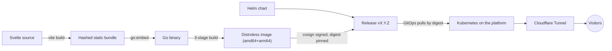

# lidersea.com

[](https://github.com/snaraj/lidersea.com/actions/workflows/pr-gate.yml)
[](https://github.com/snaraj/lidersea.com/actions/workflows/codeql.yml)
[](https://github.com/snaraj/lidersea.com/releases)
[](https://github.com/snaraj/lidersea.com/actions/workflows/pr-gate.yml)
[](https://github.com/snaraj/lidersea.com/actions/workflows/pr-gate.yml)
[](go.mod)
[](LICENSE)

The web home of Lidersea — luxury yacht maintenance, customization, and
detailing. This site is built to the same standard as the craft it
represents: a Svelte frontend embedded into a single dependency-free Go
binary, shipped as a distroless multi-arch container and a Helm chart,
deployed by digest behind Cloudflare.

## How it works



The Go service serves the embedded bundle with strict caching, conditional
requests, security headers, and `/livez` + `/readyz` probes on port 8080,
with no runtime dependency beyond the Go standard library.

Public traffic is HTTPS-only: TLS terminates at the Cloudflare edge, and
the tunnel carries plain HTTP to an origin that is never itself publicly
reachable; the edge already redirects plain `http://` to `https://`
(`301`). This origin's own `Strict-Transport-Security: max-age=31536000`
is overwritten by the edge's before a visitor ever sees it, and the edge
now serves `max-age=31536000; includeSubDomains`. The two lifetimes are
therefore identical — 365 days on each side — and the only difference a
visitor can observe is the scope the edge adds; `preload` is absent.
That is a deployment fact recorded here, not enforced by this repository.

A first-level subdomain proxied through Cloudflare already gets valid TLS
from the apex wildcard cert, so the real trap is one level deeper: a
wildcard covers exactly one label, so `api.staging.lidersea.com` has no
free TLS path — only Cloudflare's paid Advanced Certificate Manager
reaches it, colliding with this repo's zero-spend requirement. The very
first visit to an unknown host is where HSTS cannot help: with no cached
policy, its `http://` request leaves in the clear, and a longer lifetime
changes nothing about that, so only the edge's `301` — a mitigation, not
a guarantee — can act on it (RFC 6797's bootstrap gap; only `preload`
closes it, and only once the domain is actually submitted and shipped in
browsers). The edge now clears that bar on lifetime and scope, since the
preload list wants at least `max-age=31536000` plus `includeSubDomains`,
and the edge response carries both. What is left is the `preload`
directive itself and a deliberate decision to submit — not a lifetime to
raise. HSTS's real value is every visit after: once cached, the browser
rewrites any later `http://` link, typed hostname, or downgrade attempt
to `https://` itself for as long as `max-age` lasts — no plaintext
request ever leaves.

## Development

```sh
# Frontend first — the Go embed test expects the built bundle.
cd frontend
npm ci --ignore-scripts
npm run check && npm test && npm run build

# Backend
cd ..
go vet ./... && go test ./...

# Container (both production architectures)
docker build .
```

Toolchain pins live in CI (`node 24.19.0`, `npm 11.17.0`, `go 1.26.6`);
CI is authoritative.

## Releases

Every protected-main merge that changes an artifact publishes exactly one patch
release only after the merged SHA's exact main CI succeeds. A merge whose every
commit is confined to the documentation allowlist — root `AGENTS.md`,
`README.md`, `.gitignore`, and Markdown under `docs/` — changes no artifact, so
it advances no version and publishes nothing; the orchestrator re-proves the
whole gap as documentation against an anchor the merge cannot choose, and logs
an explicit verdict instead of dispatching the publisher. There are two such
anchors and either will do: the retained release tag, or — when that tag does
not exist, which is common while a release-pipeline defect is open — the last
successful protected-main gate head from the Actions record, which additionally
requires every release lock to be byte-identical to it. A merge is denied only
when BOTH anchors are unavailable, and a tag probe that never returns a
definitive answer counts as unknown rather than absent, so it denies too.
Nothing is relaxed by that: an unchanged artifact has nothing to version,
sign, scan, or attest, and documentation merges still run the entire PR
gate. The orchestrator paginates the PR-gate jobs and requires `security`,
`application`, `chart`, and main-only `coverage-badges` to succeed while the
PR-only `dependency-review` and `container` jobs are explicitly skipped on a
push; both remain required checks on the pull request itself. It
separately waits for the same-SHA main CodeQL run and requires both analyze
jobs to succeed. The merged source carries numeric `X.Y.Z` in `VERSION`,
chart `version`, `appVersion`, and the dated changelog heading, and exact
plain `vX.Y.Z` in the image tag. Automation creates that plain tag at the
exact SHA and explicitly dispatches the publisher definition from protected
`main` with both authoritative successful-run IDs. A separate read-only job
revalidates both aggregate records and both exact job inventories before the
write/packages/OIDC job can start; absent, pending, skipped, failed, duplicate,
foreign, and wrong-SHA evidence fails closed. A manual dispatch for an
unmerged branch fails before publication. Before its first registry read or
write, the publisher binds the dotted repository `snaraj/lidersea.com` to the
explicit, non-derived package identities `ghcr.io/snaraj/lidersea-com` and
`ghcr.io/snaraj/charts/lidersea-com`; an implicit dotted or renamed package is
denied. A
second isolated job mints a repository-scoped, Administration-read-only App
token and rechecks the immutable-release, Actions, ruleset, signing, and
security controls before any tag or artifact side effect. The ordinary
`GITHUB_TOKEN` remains the sole mutation credential.
Both enabled merge modes are covered: a squash is one linear commit, while a
rebase may install several commits in one push. Every intermediate `VERSION`
state must retain the current version or advance exactly one patch; skips,
reversions, transient future values, and multiple release boundaries in one
integration are denied. The publisher builds or verifies:

- `ghcr.io/snaraj/lidersea-com:vX.Y.Z` — multi-arch image, keyless-signed
  (Cosign), with exact signed amd64/arm64 SPDX SBOM payloads and SLSA
  provenance; deployment consumes the digest.
- `ghcr.io/snaraj/charts/lidersea-com:X.Y.Z` — the Helm chart as a signed OCI
  artifact. This is the one narrow tag exception: Helm requires the registry
  tag to equal valid chart SemVer, and `vX.Y.Z` is not SemVerV2.
- A GitHub Release whose sole machine-identity asset is canonical
  `release-manifest.json`, binding the exact source, image digest, chart digest,
  signature identity, SBOM set, and provenance set. Human-readable Release
  title and notes are informational. The Release author and sole manifest-asset
  uploader must both be the canonical `github-actions[bot]` account with
  numeric ID `41898282`.

The annotated Git tag is never reassigned, and the GitHub Release is accepted
only when REST reports it immutable. Image and chart version tags are mutable
registry aliases; the manifest's `sha256:` digests are the immutable artifact
identities. A retry reuses only exact, complete, correctly signed digest-bound
state; partial or conflicting state is reported as burned and requires a new
patch. The manifest is created mode `0600`, uploaded while the Release is
Draft, and verified byte-for-byte before publication. The publisher then ends
with an unconditional REST rebind of both the annotated tag ref and object.
Both intended registry aliases are authenticated from exact response bytes and
digest headers after push, immediately before manifest staging, and again
before the immutable Release transition; a wrong destination, lost response
without authoritative recovery, or concurrent retarget cannot publish.
Before this automatic path may leave Draft, the repository owner's GET-only
receipt must prove the full server contract; see
[release governance](docs/release-governance.md). Release publication is
separate from deployment or promotion. History lives in
[CHANGELOG.md](CHANGELOG.md); the security posture in
[SECURITY.md](SECURITY.md).

An OCI reference such as `image:vX.Y.Z@sha256:<digest>` or
`chart:X.Y.Z@sha256:<digest>` contains a tag plus immutable digest; the complete
string is a reference, never a tag. Publication scans the final image digest for
HIGH/CRITICAL vulnerabilities before signing. A scheduled read-only audit
rescans that digest and rechecks registry-alias bindings, signatures, exact
two-platform signed SPDX SBOM payloads and provenance attestations, the chart digest, the manifest, and
the annotated Git tag.
The recurring filesystem gate uses Trivy's `--include-dev-deps` mode and
validates that every direct frontend `devDependency` in the lock-backed
production build graph entered the report before accepting a clean result.

## Media

The site ships no media yet. When small UI assets arrive they will live
under `frontend/src/assets/` in documented categories with size ceilings,
mirroring naranjo.online. Heavy media (portfolio video, high-resolution
photography, audio) never enters this repository or the image — it will be
served from dedicated platform storage, built for it.

## License

Code is [MIT](LICENSE). Site content — text, images, video, audio,
branding — is **all rights reserved**; the license does not extend to it.
