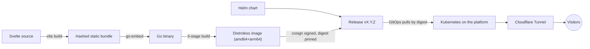

# lidersea.com

The web home of Lidersea — luxury yacht maintenance, customization, and
detailing. This site is built to the same standard as the craft it
represents: a Svelte frontend embedded into a single dependency-free Go
binary, shipped as a distroless multi-arch container and a Helm chart,
deployed by digest behind Cloudflare.

## How it works

The Go service serves one shell per reading theme (chosen by a cookie the
browser writes and the origin only reads, each variant its own cached
resource), the embedded bundle with strict caching and conditional
requests, the read-only `surface/v1` API (board, reviews, estimates,
ratings — with the write carve-outs shipped contract-defined but
disabled), an env-gated immutable-media path, and `/livez` + `/readyz`
probes on port 8080, all with no runtime dependency beyond the Go
standard library.

Public traffic is HTTPS-only: TLS terminates at the Cloudflare edge, and
the tunnel carries plain HTTP to an origin that is never itself publicly
reachable; the edge already redirects plain `http://` to `https://`
(`301`). Exactly one `Strict-Transport-Security` header reaches a
visitor and it is the edge's `max-age=31536000; includeSubDomains`, so
this origin's own `max-age=31536000` is never what a browser is told.
The two lifetimes are therefore identical — 365 days on each side — and
the only difference a visitor can observe is the scope the edge adds;
`preload` is absent. That is a deployment fact recorded here, not
enforced by this repository.

## Development

The full local gate — frontend, backend, chart, container, and both
secret scans — is canonical in `AGENTS.md` ("Quality gates — exact
commands and patterns"); run it exactly as written there before every
push, plus the browser smoke lane (`cd frontend && npm run smoke`) for
rendering changes. Toolchain pins live in CI (`node 24.19.0`,
`npm 11.17.0`, `go 1.26.6`); CI is authoritative.

## Releases

Every protected-main merge that changes an artifact publishes exactly one
patch release only after the merged SHA's exact main CI succeeds. A merge
whose every commit is confined to the documentation allowlist — root
`AGENTS.md`, `README.md`, `.gitignore`, and Markdown under `docs/` —
changes no artifact, advances no version, and publishes nothing; the
orchestrator proves that class against an anchor the merge cannot choose
and logs an explicit verdict instead of dispatching the publisher. The
complete pipeline — the two classification anchors, job-inventory
authorization, the isolated App-token settings recheck, explicit package
identity binding, the manifest draft/upload/publish state machine,
signatures, SBOM and provenance sets, vulnerability gates, and the
scheduled read-only integrity audit — is canonical in `AGENTS.md`
requirement 10 and [release governance](docs/release-governance.md); this
section is a summary, not a second copy.

The publisher builds or verifies the multi-arch image
`ghcr.io/snaraj/lidersea-com:vX.Y.Z` (keyless-signed, with exact signed
amd64/arm64 SPDX SBOM payloads and SLSA provenance), the signed OCI chart
`ghcr.io/snaraj/charts/lidersea-com:X.Y.Z` (numeric because Helm requires
chart-SemVer registry tags), and a GitHub Release whose sole
machine-identity asset is the canonical `release-manifest.json`, accepted
only when REST reports the Release immutable. Image and chart version
tags are mutable registry aliases; the manifest's `sha256:` digests are
the immutable artifact identities, and deployment resolves digests, never
aliases — an OCI reference such as `image:vX.Y.Z@sha256:<digest>` is a
reference, never a tag. This automatic path may not leave Draft until the
repository owner's GET-only receipt proves the full server contract.
Release publication is separate from deployment or promotion. History
lives in [CHANGELOG.md](CHANGELOG.md); the security posture in
[SECURITY.md](SECURITY.md).

## Media

Media serving is the origin's own `internal/media` pipeline:
digest-immutable URLs (`/media/immutable/<sha256>/<name>`) from an
env-gated directory with HTTP Range support, immutable caching, a
media-type allowlist, and a concurrency bound — disabled unless its
environment is configured, so the default build serves no media. Heavy
media masters (portfolio video, high-resolution photography, audio) never
enter this repository or the image; they belong to dedicated platform
storage.

## License

Code is [MIT](LICENSE). Site content — text, images, video, audio,
branding — is **all rights reserved**; the license does not extend to it.
