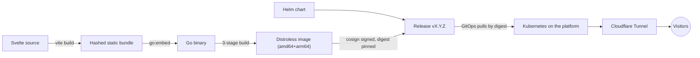

# lidersea.com

[](https://github.com/snaraj/lidersea.com/actions/workflows/pr-gate.yml)
[](https://github.com/snaraj/lidersea.com/actions/workflows/codeql.yml)
[](https://github.com/snaraj/lidersea.com/releases)
[](https://github.com/snaraj/lidersea.com/actions/workflows/pr-gate.yml)
[](https://github.com/snaraj/lidersea.com/actions/workflows/pr-gate.yml)
[](go.mod)
[](LICENSE)

The web home of Lidersea — luxury yacht maintenance, customization, and
detailing. This site is built to the same standard as the craft it
represents: a Svelte frontend embedded into a single dependency-free Go
binary, shipped as a distroless multi-arch container and a Helm chart,
deployed by digest behind Cloudflare.

## How it works



The Go service serves the embedded bundle with strict caching, conditional
requests, security headers, and `/livez` + `/readyz` probes on port 8080,
with no runtime dependency beyond the Go standard library.

## Development

```sh
# Frontend first — the Go embed test expects the built bundle.
cd frontend
npm ci --ignore-scripts
npm run check && npm test && npm run build

# Backend
cd ..
go vet ./... && go test ./...

# Container (both production architectures)
docker build .
```

Toolchain pins live in CI (`node 24.19.0`, `npm 11.17.0`, `go 1.26.5`);
CI is authoritative.

## Releases

Pushing `vX.Y.Z` (matching `VERSION` and the chart version — CI enforces
the three-way lock) publishes everything at once:

- `ghcr.io/snaraj/lidersea-com:vX.Y.Z` — multi-arch image, keyless-signed
  (Cosign), with SBOM and SLSA provenance; deployment consumes the digest.
- `ghcr.io/snaraj/charts/lidersea-com` — the Helm chart as a signed OCI
  artifact at the same version.
- A GitHub Release recording the immutable digests.

Version tags are immutable and never reused — the publisher refuses, with
no override. History lives in [CHANGELOG.md](CHANGELOG.md); the security
posture in [SECURITY.md](SECURITY.md).

## Media

Small UI assets live under `frontend/src/assets/` in documented categories
with size ceilings. Heavy media (portfolio video, high-resolution
photography, audio) never enters this repository or the image — it is
served from dedicated platform storage, built for it.

## License

Code is [MIT](LICENSE). Site content — text, images, video, audio,
branding — is **all rights reserved**; the license does not extend to it.
